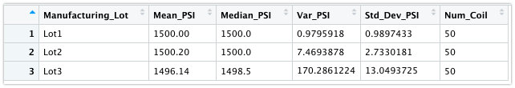

# Background

A few weeks after starting his new role, Jeremy is approached by upper management about a special project. AutosRUs’ newest prototype, the MechaCar, is suffering from production troubles that are blocking the manufacturing team’s progress. AutosRUs’ upper management has called on Jeremy and the data analytics team to review the production data for insights that may help the manufacturing team.

In this challenge, we’ll help Jeremy and the data analytics team do the following:
 - Linear regression analysis to identify which variables in the dataset predict the mpg of MechaCar prototypes
 - Summary statistics on the pounds per square inch (PSI) of the suspension coils from the manufacturing lots
 - T-tests to determine if the manufacturing lots are statistically different from the mean population
 - Statistical study to compare vehicle performance of the MechaCar vehicles against vehicles from other manufacturers. 

## Linear Regression to Predict MPG

The `MechaCar_mpg.csv` dataset contains mpg test results for 50 prototype MechaCars. The MechaCar prototypes were produced using multiple design specifications to identify ideal vehicle performance. Multiple metrics, such as vehicle length, vehicle weight, spoiler angle, drivetrain, and ground clearance, were collected for each vehicle. 

### `mpg = (6.267)vehicle_length + (0.00124)vehicle_weight + (0.0687)spoiler_angle + (3.546)ground_clearance + (-3.41)AWD + (-104.0)`

``` r
> lm(mpg ~ vehicle_length + vehicle_weight + spoiler_angle + ground_clearance + AWD, data=mecha_mpg)

Call:
lm(formula = mpg ~ vehicle_length + vehicle_weight + spoiler_angle + 
    ground_clearance + AWD, data = mecha_mpg)

Coefficients:
     (Intercept)    vehicle_length    vehicle_weight     spoiler_angle  ground_clearance               AWD  
      -1.040e+02         6.267e+00         1.245e-03         6.877e-02         3.546e+00        -3.411e+00  

> summary(lm(mpg ~ vehicle_length + vehicle_weight + spoiler_angle + ground_clearance + AWD, data=mecha_mpg))

Call:
lm(formula = mpg ~ vehicle_length + vehicle_weight + spoiler_angle + 
    ground_clearance + AWD, data = mecha_mpg)

Residuals:
     Min       1Q   Median       3Q      Max 
-19.4701  -4.4994  -0.0692   5.4433  18.5849 

Coefficients:
                   Estimate Std. Error t value Pr(>|t|)    
(Intercept)      -1.040e+02  1.585e+01  -6.559 5.08e-08 ***
vehicle_length    6.267e+00  6.553e-01   9.563 2.60e-12 ***
vehicle_weight    1.245e-03  6.890e-04   1.807   0.0776 .  
spoiler_angle     6.877e-02  6.653e-02   1.034   0.3069    
ground_clearance  3.546e+00  5.412e-01   6.551 5.21e-08 ***
AWD              -3.411e+00  2.535e+00  -1.346   0.1852    
---
Signif. codes:  0 ‘***’ 0.001 ‘**’ 0.01 ‘*’ 0.05 ‘.’ 0.1 ‘ ’ 1

Residual standard error: 8.774 on 44 degrees of freedom
Multiple R-squared:  0.7149,	Adjusted R-squared:  0.6825 
F-statistic: 22.07 on 5 and 44 DF,  p-value: 5.35e-11

```

> Which variables/coefficients provided a non-random amount of variance to the mpg values in the dataset?

Based on output shown above, `vehicle_length` and `vehicle_ground_clearance` provided a non-random amount of variance to the `mpg` values in the dataset.

> Is the slope of the linear model considered to be zero? Why or why not?

With a very low value of p-value, the slope of linear model is not zero.


> Does this linear model predict mpg of MechaCar prototypes effectively? Why or why not?
Based on R-Squared values (0.7149), the model is predicting `mpg` value effectively. 

---

## Suspension Coil - Summary Statistics

The MechaCar `Suspension_Coil.csv` dataset contains the results from multiple production lots. In this dataset, the weight capacities of multiple suspension coils were tested to determine if the manufacturing process is consistent across production lots. 

    The suspension coil’s PSI continuous variable across all manufacturing lots
    The following PSI metrics for each lot: mean, median, variance, and standard deviation.

> The design specifications for the MechaCar suspension coils dictate that the variance of the suspension coils must not exceed 100 pounds per square inch. Does the current manufacturing data meet this design specification for all manufacturing lots in total and each lot individually? Why or why 
not?
### Total Summary

### Lot Summary


The variance of the coils is 62.29 PSI, which is well within the 100 PSI variance requirement. Lo1 & Lot2 are well below the accepted variance limit. However, Lot3 variance with 170.2 is exceeding the design specification.

We can see it visually


---
## T-Test on Suspension Coil
We will perform t-tests to determine if all manufacturing lots and each lot individually are statistically different from the population mean of 1,500 pounds per square inch.

### T-Test for all Lots
Results:
``` r
> t.test(mecha_coil$PSI,mu=1500) # for PSI t-test

	One Sample t-test

data:  mecha_coil$PSI
t = -1.8931, df = 149, p-value = 0.06028
alternative hypothesis: true mean is not equal to 1500
95 percent confidence interval:
 1497.507 1500.053
sample estimates:
mean of x 
  1498.78 
```

### T-Test for Lot1
Results:
``` r
> t.test(lot1$PSI,mu=1500)

	One Sample t-test

data:  lot1$PSI
t = 0, df = 49, p-value = 1
alternative hypothesis: true mean is not equal to 1500
95 percent confidence interval:
 1499.719 1500.281
sample estimates:
mean of x 
     1500 

```

### T-Test for Lot2
Results:
``` r
> t.test(lot2$PSI,mu=1500)

	One Sample t-test

data:  lot2$PSI
t = 0.51745, df = 49, p-value = 0.6072
alternative hypothesis: true mean is not equal to 1500
95 percent confidence interval:
 1499.423 1500.977
sample estimates:
mean of x 
   1500.2 

```

### T-Test for Lot3
Results:
``` r
> t.test(lot3$PSI,mu=1500)

	One Sample t-test

data:  lot3$PSI
t = -2.0916, df = 49, p-value = 0.04168
alternative hypothesis: true mean is not equal to 1500
95 percent confidence interval:
 1492.431 1499.849
sample estimates:
mean of x 
  1496.14 

```

---
## Study Design: MechaCar vs Competition
Design a statistical study to compare performance of the MechaCar vehicles against performance of vehicles from other manufacturers.

The statistical study design has the following:

    A metric to be tested is mentioned
    A null hypothesis or an alternative hypothesis is described
    A statistical test is described to test the hypothesis

This study would involve collecting data on MechaCar and its comparable models across several different manufacturers over the last 3 years.

    What are the competitions' comparable models,
    Which cars will MechaCar be competing with head-to-head? which cars will be included in the study?
    Which factors will look at the study to determine the relevant to selling price?

### Metrics
We should be collecting data for following metrics;
- MSRP - Price of the car
- Fuel Type - Hybrid, Electric, Gasoline
- 5- year price depreciation
- MPG
- Average Repair Cost


### Null or Alternative Hypothesis
Once we know the key metrics dictating MechaCar genre, we can define following hypotheses.

**Null Hypothesis** MechaCar _IS_ priced appropriately for its genre based on performance metrics
**Alternate Hypothesis** MechaCar _IS NOT_ priced appropriately for its genre based on performance metrics

### Statistical Test
 **A Multiple Linear Regression** statistical test will be suitable to identifiy key metrics with significant impact of list price.
 